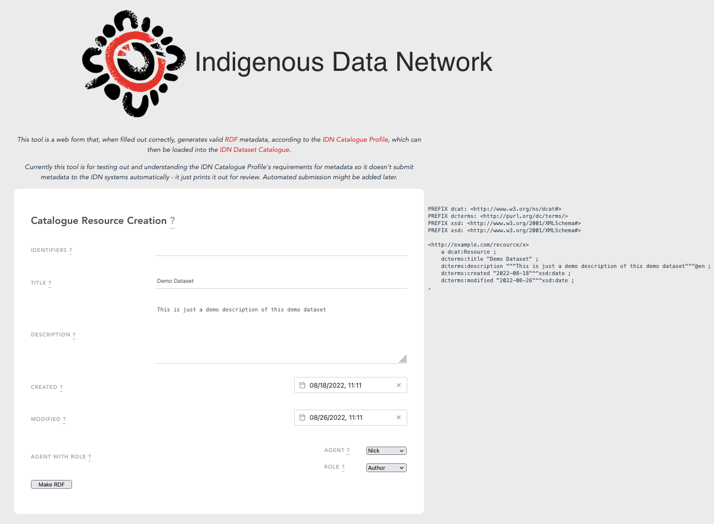

= IDN Metadata Creator

This repository contains a single page application (web page) form tool that, when filled out correctly, generates valid https://www.w3.org/RDF/[RDF] metadata, according to the https://linked.data.gov.au/def/idncp/spec[IDN Catalogue Profile], which can then be loaded into the https://idnau.org/catalogue[IDN Dataset Catalogue].

Currently this tool is for testing out and understanding the IDN Catalogue Profile's requirements for metadata so it doesn't submit metadata to the IDN systems automatically - it just prints it out for review. Automated submission might be added later.

When running, this application looks something like this:

.A screenshot of this application

== License & Rights

The contents of this repository is licensed under Creative Commons 4.0 International. See the LICENSE file in the repository for details.

All content is &copy; Indigenous Data Network, 2022

== Contacts

Initial technical development of this work is being undertaken by the following, for the Indigenous Data Network:

**Nicholas J. Car** +
*Data Architect* +
https://kurrawong.net[Kurrawong AI] +
nick@kurrawong.net

**Sandra Silcot** +
*Analyst* +
University of Melbourne +
Indigenous Data Network +